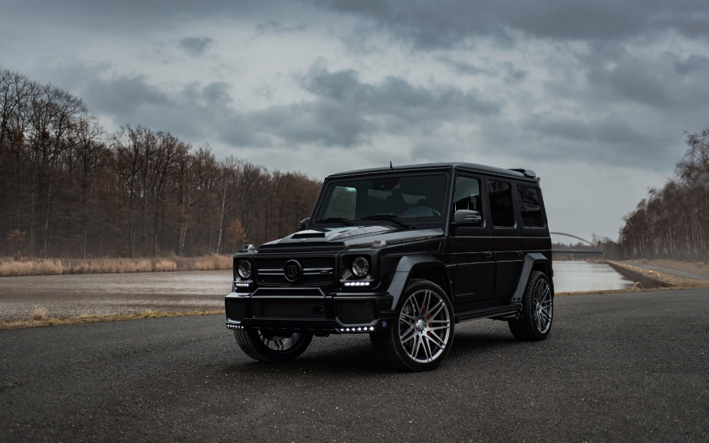

# Мое руководство по гид

## Семинар 1

### Руководство поменьше

**Это полужирное начертание**.

*Это курсивное начертание*.

***Полужирное курсивное начертание***

~~Зачёркнутый текст~~

## Семинар 2

git branch - мы выводим в терминал все ветки

создаем merge конфликт 

git log - выводит все сделанные нами коммиты

Geländewagen - легендарный немецкий внедорожник, давший название целому классу современных автомобилей. Гелендваген, он же Джи-ваген (G-Wagen), кубик, гелик – полноприводный полноразмерный автомобиль повышенной проходимости, продающийся под брендом Мерседес Бенц, родоначальник семейства Mercedes-Benz G-Class. Используется армиями шестидесяти трех стран, является официальным папомобилем для перевозки его святейшества Папы Римского.

НОВОГОДНИЕ ИГРУШКИ СВЕЧИ И ХЛОПУШКИ В НЕМ!